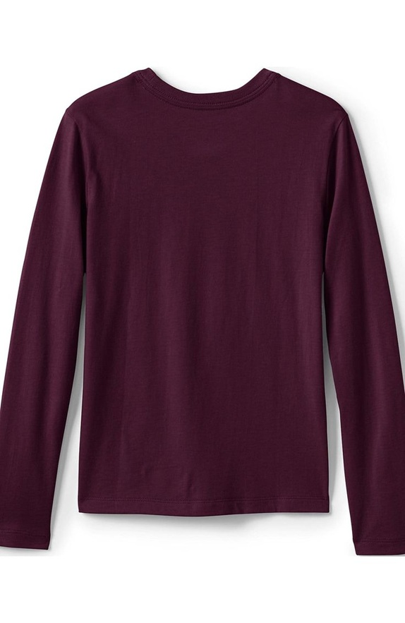
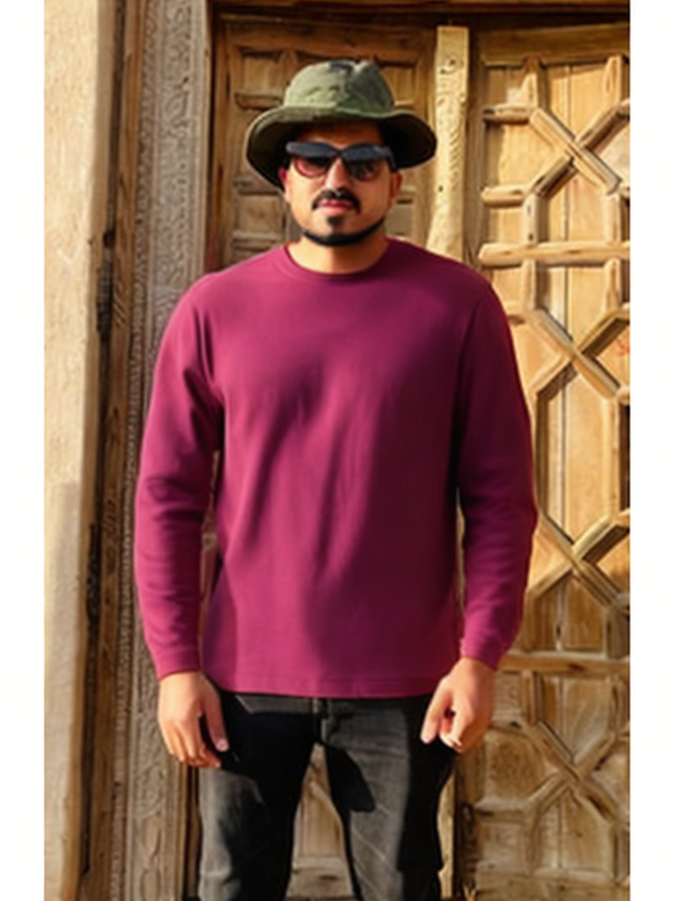
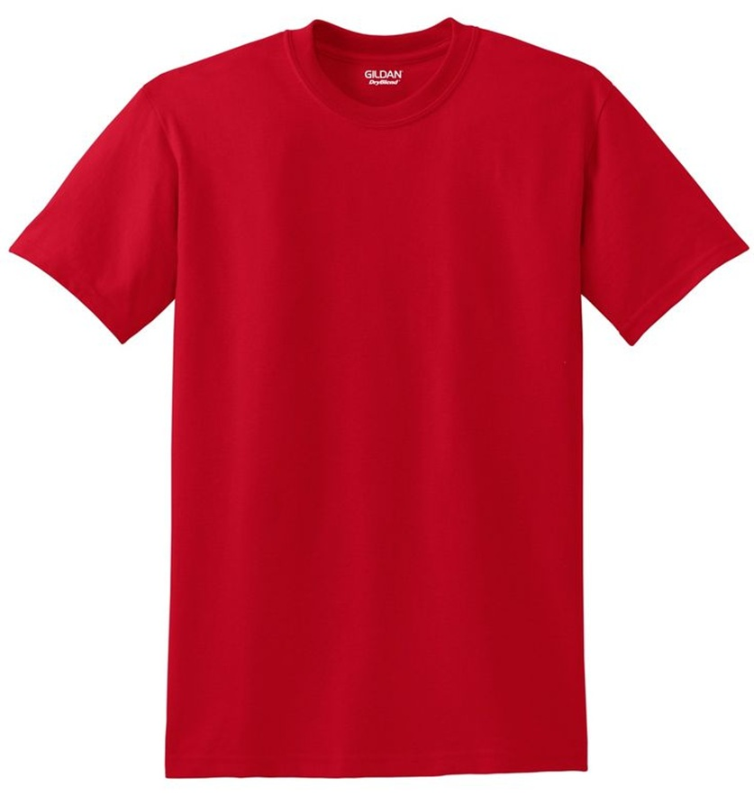
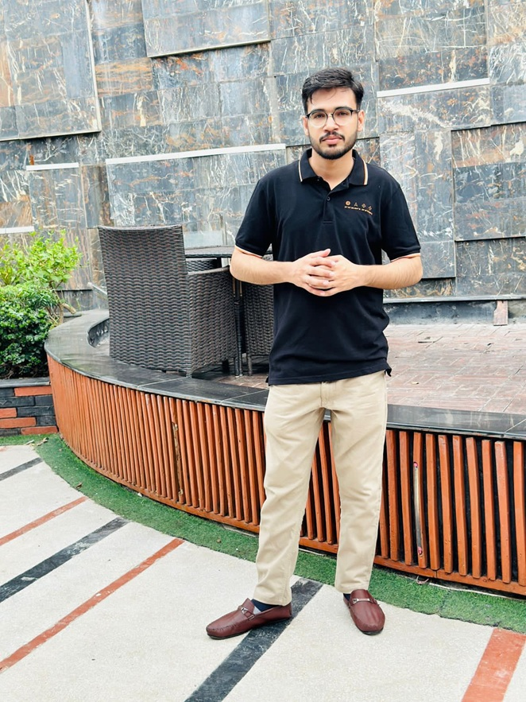
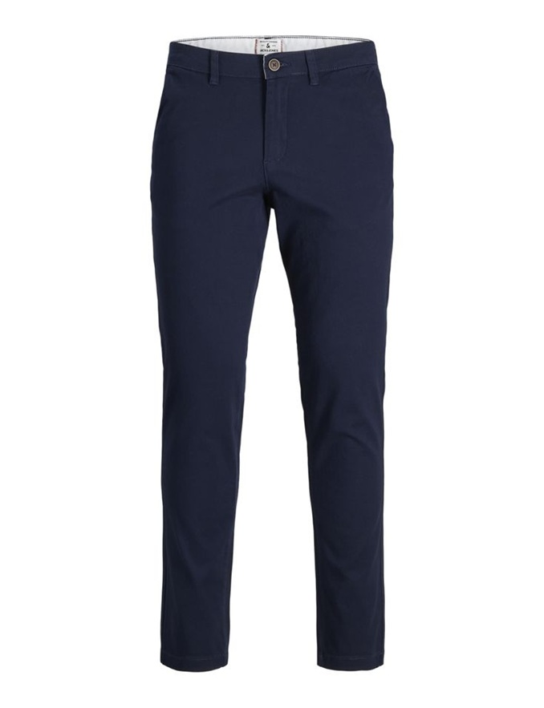

## Sample Results

| Input Person | Input Garment | Output Try-On |
|:------------:|:-------------:|:-------------:|
|  |  |  |
|  |  |  |
|  |  |  |
|  |  | ) |

---

## Project Description

This repository implements a **virtual try-on** system that:

1. Detects human body landmarks & segments the person using DensePose.  
2. Extracts, warps, and masks garments.  
3. Fuses the garment onto the person via image processing techniques and optionally via a diffusion-based pipeline for photorealism.  
4. Provides a **Next.js** frontend with a **FastAPI** backend for user interaction and image processing.


## Methodology

1. **Person Detection & DensePose**  
   - Load input image → run Detectron2’s person detector.  
   - Estimate surface UV coordinates via DensePose.  

2. **Garment Extraction & Warping**  
   - Crop out the garment from a reference image.  
   - Compute UV-to-image mapping → generate a mask.  
   - Optionally apply horizontal flip / augmentations.

3. **Mask & Chart Processing**  
   - Convert DensePose outputs (charts, IUV) into segmentation masks.  
   - Align garment mask to target UV chart.

4. **Diffusion-Based Rendering**  
   - Pass person image, garment mask, and UV chart into Stable Diffusion (through HuggingFace’s Diffusers).  
   - Use `peft` fine-tuning for better cloth adherence.  
   - Postprocess output: blend seamlessly with original background.

5. **Web Interface**  
   - Next.js API endpoints proxy calls to the Python backend.  
   - Real-time previews with Gradio/React.  
   - Slider controls for blend strength, color adjustments.

---

## Installation

### 1. Clone & Setup
```bash
git clone https://github.com/yourusername/COTTON-size-does-matter.git
cd "COTTON-size-does-matter/Virtual Try On"
```

### 2. Python Environment
```powershell
python -m venv .venv
.\.venv\Scripts\Activate
pip install -r requirements.txt
```

### 3. Frontend Dependencies
```powershell
cd frontend
npm install
```

---

## Usage

### Backend (FastAPI)
```powershell
# Navigate to the FastAPI directory
cd frontend\fastAPI
python main.py  # Starts the FastAPI server on http://localhost:8000
```

Endpoints:
- `POST /api/try-on`  
  • Body: Form data with `user_image`, `cloth_image`, and `category_id`  
  • Returns: `{ "status": "success", "data": { "id", "status", "user_image_url", "cloth_image_url", "cloth_type" } }`

- `GET /api/try-on/{try_on_id}`  
  • Returns: `{ "status": "success", "data": { "id", "status", "user_image_url", "cloth_image_url", "result_image_url" } }`

### Frontend (Next.js)
```powershell
cd frontend
npm run dev  # Starts the Next.js app on http://localhost:3000
```
Open your browser → upload a person & clothing image → click "Try On."

---

## Configuration

### Environment Variables
Create a `.env` file in the `frontend/fastAPI` directory with the following variables:

```env
SUPABASE_URL=your_supabase_url
SUPABASE_ANON_KEY=your_supabase_anon_key
CLOUDINARY_CLOUD_NAME=your_cloudinary_cloud_name
CLOUDINARY_API_KEY=your_cloudinary_api_key
CLOUDINARY_API_SECRET=your_cloudinary_api_secret
GPU_ENDPOINT_URL=optional_gpu_endpoint_for_processing
```

### Next.js Configuration
Update `frontend/.env.local` if needed:
```env
NEXT_PUBLIC_BACKEND_URL=http://localhost:8000
```

Use OmegaConf YAML files under `/densepose/configs/` to override training/inference settings.

---

## Setting Up External Services

The application relies on three external services that you need to set up before running. After setting up each service, copy the required values into your `.env` file in `frontend/fastAPI`.

### 1. Supabase Setup

1. Create a free account at [Supabase](https://supabase.com/)
2. Create a new project
3. Once your project is created, navigate to Project Settings > API
4. Copy the `URL` and `anon/public` key to your `.env` file:
   ```
   SUPABASE_URL=your_supabase_url
   SUPABASE_ANON_KEY=your_anon_key
   ```
5. Create a table named `try_on_history` with the following columns:
   - `id` (primary key, UUID)
   - `user_image_url` (text)
   - `cloth_image_url` (text)
   - `cloth_type` (text)
   - `status` (text)
   - `result_image_url` (text, nullable)
   - `created_at` (timestamp with timezone)
   - `completed_at` (timestamp with timezone, nullable)
   - `error` (text, nullable)

**Tip:** You can use the Supabase Table Editor UI to create these columns easily.

### 2. Cloudinary Setup

1. Create a free account at [Cloudinary](https://cloudinary.com/)
2. From your dashboard, copy the following credentials to your `.env` file:
   ```
   CLOUDINARY_CLOUD_NAME=your_cloud_name
   CLOUDINARY_API_KEY=your_api_key
   CLOUDINARY_API_SECRET=your_api_secret
   ```

**Tip:** You can find these values in your Cloudinary dashboard under Account Details.

### 3. Ngrok GPU Endpoint (Optional, for AI processing)

1. Run the `Ngrok-GPU-Endpoint.ipynb` notebook on a GPU instance:
   - Upload to [Kaggle](https://www.kaggle.com/) and use a T4 GPU
   - Or use any other GPU cloud service (Google Colab, etc.)
2. The notebook will generate an Ngrok endpoint URL
3. Add this URL to your `.env` file with `/process-images` appended:
   ```
   GPU_ENDPOINT_URL=https://your-ngrok-url.ngrok-free.app/process-images
   ```

**Tip:** The Ngrok endpoint should look like `https://xxxx-xx-xx-xx-xx.ngrok-free.app/process-images`. Make sure to include `/process-images` at the end.

**How to use:**
1. Run the Ngrok-GPU-Endpoint notebook on Kaggle (T4 GPU) or any other GPU instance.
2. Copy the Ngrok public URL shown in the notebook output.
3. Add `/process-images` to the end of the URL and set it as `GPU_ENDPOINT_URL` in your `.env` file in `frontend/fastAPI`.
4. Start the backend and frontend as described below.
5. Your app is now ready for use!

Without the GPU endpoint, the application will still work using local image processing, but the try-on results will be of lower quality.


## 🔧 Troubleshooting

### Common Issues

1. **Environment Variables Not Loading**
   - Ensure your `.env` file is encoded as UTF-8 without BOM
   - Check that all required variables are set correctly

2. **API Endpoints Return 404**
   - Verify FastAPI server is running on port 8000
   - Check if routes are correctly registered

3. **Image Processing Fails**
   - Ensure Cloudinary credentials are correct
   - Verify uploaded images are in supported formats (JPEG, PNG)

4. **Frontend Can't Connect to Backend**
   - Check CORS settings in FastAPI
   - Verify the backend URL in Next.js configuration


## 📄 License

This project is licensed under the **MIT License**. See [LICENSE](./LICENSE) for details.
